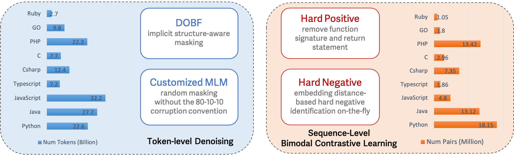

# CodeSage: Code Representation Learning At Scale

This repository contains the data and inference code of the ICLR 2024
paper "[CodeSage: Code Representation Learning At Scale](https://arxiv.org/abs/2402.01935)." 

Work done by Dejiao Zhang*, Wasi Uddin Ahmad*, Ming Tan,
Hantian Ding, Ramesh Nallapati, Dan Roth, Xiaofei Ma, Bing Xiang (* <em>indicates equal contribution</em>). 

## Overview
<p align="center">
</img>
</p>
<p align="center">An overview of the key ingredients of CodeSage for code representation learning.</p>

## Environment Setup

```
conda create -n codesage_eval python=3.10
conda activate codesage_eval
pip install -r requirements.txt
```

## Run Evaluation

### Code-to-Code Search

See [data preparation](data/code2code/README.md) before running evaluation scripts.

```
bash scripts/run_code2code_search.sh MODEL_NAME SRC_LANG TGT_LANG
```

where

- MODEL_NAME = `[codesage-small|codesage-base|codesage-large]`
- SRC_LANG and TGT_LANG = `[python|java|c|c++|csharp|ruby|php|go|javascript|typescript]`

### Text-to-Code Search

See [data preparation](data/nl2code/README.md) before running evaluation scripts.

```
bash scripts/run_nl2code_search.sh MODEL_NAME DATASET_NAME
```

where

- MODEL_NAME = `[codesage-small|codesage-base|codesage-large]`
- SRC_LANG and TGT_LANG = `[cosqa|advTest|csn]`

### Code Classification

```
# clone detection
bash scripts/run_clone_detection.sh
# complexity prediction
bash scripts/run_complexity_prediction.sh
# defect prediction
bash scripts/run_defect_prediction.sh
# runtime error prediction
bash scripts/run_runtime_error_prediction.sh
```

### Benchmark 
Wanna compare CodeSage against the latest embedding model? Check out our code for [benchmarking](benchmark/run_benchmark.py)

## Citation

```
@inproceedings{
    zhang2024codesage,
    title={CodeSage: Code Representation Learning At Scale},
    author={Dejiao Zhang* and Wasi Ahmad* and Ming Tan and Hantian Ding and Ramesh Nallapati and Dan Roth and Xiaofei Ma and Bing Xiang},
    booktitle={The Twelfth International Conference on Learning Representations },
    year={2024},
    url={https://openreview.net/forum?id=vfzRRjumpX}
}
```

## Contact
If you have any question regarding our paper or code, please feel free to start an issue or email Dejiao Zhang (dejiaoz@amazon.com) and Wasi Ahmad (wuahmad@amazon.com).


## Security

See [CONTRIBUTING](CONTRIBUTING.md#security-issue-notifications) for more information.

## License

This project is licensed under the Apache-2.0 License.

